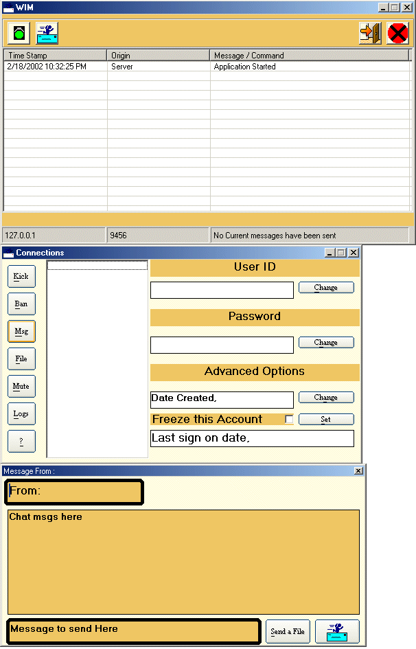

<div align="center">

## Formerly BLAIM Now WIM Instant Msg Update


</div>

### Description

This is an update to Blaim Instant messanger

Shows you how to use/handle the winsock control

Allow multi-client connections

Send and receive messages as well as files

and MUCH MORE To come

this update didnt change much from the last all but the GUI. Fell free to VOTE anytime!

UDATED today 02/19/02
 
### More Info
 


<span>             |<span>
---                |---
**Submitted On**   |2002-02-19 20:46:14
**By**             |[W\. LeRoy](https://github.com/Planet-Source-Code/PSCIndex/blob/master/ByAuthor/w-leroy.md)
**Level**          |Beginner
**User Rating**    |3.7 (11 globes from 3 users)
**Compatibility**  |VB 5\.0, VB 6\.0
**Category**       |[Internet/ HTML](https://github.com/Planet-Source-Code/PSCIndex/blob/master/ByCategory/internet-html__1-34.md)
**World**          |[Visual Basic](https://github.com/Planet-Source-Code/PSCIndex/blob/master/ByWorld/visual-basic.md)
**Archive File**   |[Formerly\_B563482192002\.zip](https://github.com/Planet-Source-Code/w-leroy-formerly-blaim-now-wim-instant-msg-update__1-31914/archive/master.zip)

### API Declarations

```
Dim GetCurrentViewer as NewVote
 GetCurrentViewer.Vote = 1 to 5
' Please Vote even if you think it's poor!
```


